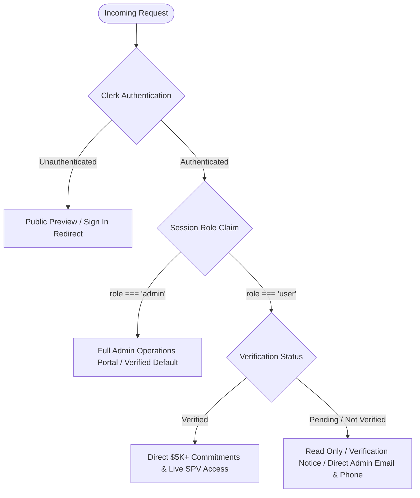
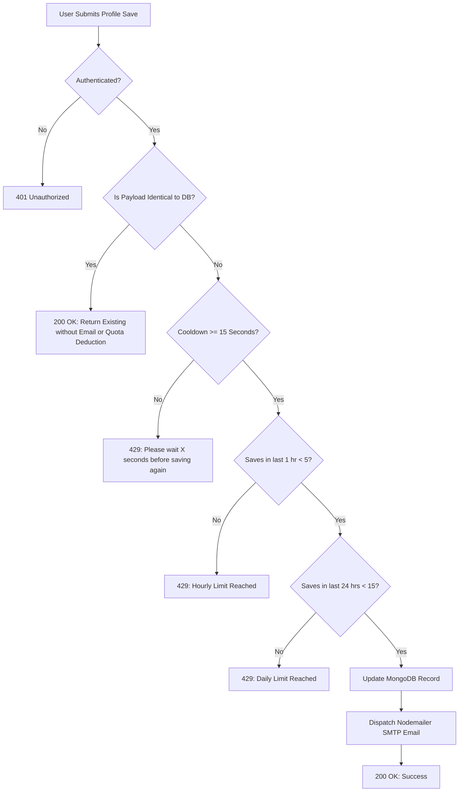

# ApexKrish Capital — System Architecture & Technical Documentation

**Version:** 3.0.0  
**Status:** Production Ready  
**Target Audience:** Engineering, Product, Security, Syndicate Operations & Administrators  
**Last Updated:** September 2026  

---

## Table of Contents

1. [Executive Summary & Platform Purpose](#1-executive-summary--platform-purpose)
2. [Technology Stack & System Topology](#2-technology-stack--system-topology)
3. [Architecture Overview & Project Structure](#3-architecture-overview--project-structure)
4. [Data Models & Schema Specifications](#4-data-models--schema-specifications)
   - [4.1 User Document Model](#41-user-document-model-modelsusermodelts)
   - [4.2 Offering Document Model](#42-offering-document-model-modelsofferingmodelts)
   - [4.3 Commitment Document Model](#43-commitment-document-model-modelscommitmentmodelts)
   - [4.4 Founder Application Document Model](#44-founder-application-document-model-modelscompany-applicationmodelts)
   - [4.5 Admin Audit Log Document Model](#45-admin-audit-log-document-model-modelsadmin-audit-logmodelts)
5. [Authentication, Authorization & RBAC](#5-authentication-authorization--rbac)
6. [Core Functional Modules & Features](#6-core-functional-modules--features)
   - [6.1 Landing Page & Dynamic Deal Room](#61-landing-page--dynamic-deal-room)
   - [6.2 Dynamic Offerings & Deal Lifecycle Engine](#62-dynamic-offerings--deal-lifecycle-engine)
   - [6.3 Founder Syndicate Applications Pipeline](#63-founder-syndicate-applications-pipeline)
   - [6.4 Investor Profile & 506(c) Accreditation Lifecycle](#64-investor-profile--506c-accreditation-lifecycle)
   - [6.5 Multi-Opportunity Administrative Command Center](#65-multi-opportunity-administrative-command-center)
   - [6.6 Investor Broadcast & Closing Portal Subsystem](#66-investor-broadcast--closing-portal-subsystem)
7. [API Route Specifications & Endpoints](#7-api-route-specifications--endpoints)
8. [Cascade Data Integrity & Auto-Cleanup Architecture](#8-cascade-data-integrity--auto-cleanup-architecture)
9. [Security, Rate Limiting & Anti-Spam Protections](#9-security-rate-limiting--anti-spam-protections)
10. [Email Dispatch Subsystem (SMTP / Nodemailer)](#10-email-dispatch-subsystem-smtp--nodemailer)
11. [Design System & Anti-Slop Architectural Standard](#11-design-system--anti-slop-architectural-standard)
12. [Deployment & Environment Configuration](#12-deployment--environment-configuration)

---

## 1. Executive Summary & Platform Purpose

**ApexKrish Capital** is a private market syndication platform engineered to connect verified, high-net-worth accredited investors with direct Special Purpose Vehicle (SPV) allocations into tier-one frontier technology companies (e.g., Micro1 Inc., Cursor/Anysphere, Scale AI, xAI, Neuralink).

### Core Value Proposition
- **Institutional Access, Founder-Friendly Economics:** Traditional private equity syndicates charge carry fees in excess of 20% on net profits. ApexKrish Capital operates on a streamlined **10% performance carry structure** (half the industry average) with discrete 2% minimum management fees.
- **Founder Fast-Track:** Single cap table entry, 30-day SPV close, and capital raises of $200K and above.
- **506(c) Compliance Workflow:** Frictionless qualification, investor self-certification, administrator verification, and immutable audit trails.
- **Precision Deal Commitment Engine:** Real-time allocation caps, minimum check sizes ($5,000 USD), binding intent capture, instant administrative lead routing, and dynamic closing portal dispatch.

---

## 2. Technology Stack & System Topology

| Layer | Technology | Rationale & Implementation Details |
| :--- | :--- | :--- |
| **Framework** | Next.js 16+ (App Router, Turbopack) | Server-side rendering (SSR), streaming client hydration, high-performance edge routing. |
| **Language** | TypeScript 5+ | Strict end-to-end type safety across schemas, API payloads, and component props. |
| **Styling & UI** | Tailwind CSS + Radix UI (Shadcn) | Architectural minimalist design system, zero runtime CSS overhead, accessible primitives. |
| **Authentication** | Clerk Auth | Multi-session handling, OAuth 2.0 (Google), session claims, metadata-driven RBAC (`role: "admin"`). |
| **Database** | MongoDB Atlas (Mongoose ODM) | Document-oriented persistence with schema validation, compound indexes, and aggregation pipelines. |
| **Email Subsystem**| Nodemailer (SMTP) | Multi-part HTML notification emails with embedded CID brand assets and fail-safe error handling. |
| **Icons** | Lucide React | High-contrast geometric iconography. |

---

## 3. Architecture Overview & Project Structure

```
my-app/
├── app/
│   ├── layout.tsx                     # Global Root Layout (ClerkProvider, Theme, Fonts, Navbar)
│   ├── page.tsx                       # Public Landing Page (Hero, Offerings, Sector Thesis, Fiduciary)
│   ├── aboutus/page.tsx               # Institutional About Us & Team Thesis
│   ├── profile/page.tsx               # Protected Investor Profile Management Route
│   ├── admin/page.tsx                 # Protected Administrative Operations Command Center
│   ├── investor-education/page.tsx    # SEC 506(c) & SPV Investor Education Portal
│   ├── api/
│   │   ├── user/profile/route.ts      # GET/POST: Profile sync, rate limiting & Nodemailer triggers
│   │   ├── offerings/
│   │   │   ├── route.ts               # GET: Public active and past offerings list
│   │   │   ├── interact/route.ts      # POST: Intent & capital commitments capture ($5K+ min)
│   │   │   └── my-interactions/       # GET: Authenticated user allocation status
│   │   ├── companies/
│   │   │   └── apply/route.ts         # POST: Founder syndicate applications submission
│   │   └── admin/
│   │       ├── offerings/route.ts     # POST/PATCH/DELETE: Admin offering CRUD & cascade delete
│   │       ├── offerings/[id]/link/   # GET/PUT: Stored closing portal links
│   │       ├── commitments/route.ts   # GET/PATCH: Active & closed commitments aggregation
│   │       ├── users/route.ts         # GET/PATCH: Investor roster & verification status
│   │       ├── company-applications/  # GET/PATCH: Founder pipeline management
│   │       └── broadcast/route.ts     # GET/POST: Email dispatch & WhatsApp wa.me links generator
├── components/
│   ├── navbar.tsx                     # Brand header with ApexKrish Capital and dynamic auth state
│   ├── HeroSection.tsx                # High-conversion hero with 10% carry value proposition
│   ├── OfferingsSection.tsx           # Live deal room, past track record, and commit modal
│   ├── BusinessApplicationSection.tsx # Founder syndicate application modal ($200K+, 30-day close)
│   ├── ProfileComponent.tsx           # Interactive investor profile form with accreditation tooltips
│   ├── AdminPage.tsx                  # 4-column deal command center & separated commitments tables
│   └── ui/                            # Shadcn UI accessible primitives (button, select, etc.)
├── models/
│   ├── user.model.ts                  # MongoDB User schema with anti-spam timestamps & roles
│   ├── offering.model.ts              # MongoDB Dynamic Offering schema with closedMonthYear & badges
│   ├── commitment.model.ts            # MongoDB Commitment schema tracking checks and allocation states
│   ├── company-application.model.ts   # MongoDB Founder Application schema with deck & diligence stages
│   └── admin-audit-log.model.ts       # MongoDB Immutable Admin Action Audit Trail
├── lib/
│   ├── dbConnect.ts                   # Cached MongoDB connection manager
│   ├── offerings-service.ts           # Offerings database initialization, deduplication & retrieval
│   ├── email.ts                       # Nodemailer SMTP transport & template compiler
│   ├── audit-logger.ts                # Administrative action logging utility
│   ├── rate-limit.ts                  # Multi-tier IP and user rolling rate limiters
│   └── utils.ts                       # Tailwind class merger (clsx + twMerge)
└── public/                            # Static brand assets (apexkrishnalogo.png, usericon.webp)
```

---

## 4. Data Models & Schema Specifications

### 4.1 User Document Model (`models/user.model.ts`)

Represents individual investor accounts, administrative privileges, accreditation qualification, and anti-abuse audit trails.

```typescript
export interface IUser {
  email: string;
  name?: string;
  firstName?: string;
  middleName?: string;
  lastName?: string;
  role?: "user" | "admin";
  phoneNumber?: string;
  avatar?: string;
  investorStatus?:
    | "Not Accredited"
    | "Accredited investor(1M+)"
    | "Qualified client(2M+)"
    | "Qualified purchaser(5M+)"
    | string;
  citizenship?: "US" | "Non-US" | string;
  verificationStatus?:
    | "pending verification"
    | "verified"
    | "not verified"
    | "yet to be verified"
    | string;
  profileUpdateHistory?: Date[];
  lastProfileUpdateAt?: Date;
  createdAt?: Date;
  updatedAt?: Date;
}
```

---

### 4.2 Offering Document Model (`models/offering.model.ts`)

Represents dynamic SPV syndication offerings, both active allocation rounds and historical closed deals.

```typescript
export interface IOffering {
  offeringId: string;           // Normalized slug identifier (e.g., "micro1-inc", "scale-ai")
  name: string;                 // Company Name (e.g., "Micro1 Inc.")
  badge: string;                // Active badge (e.g., "Active SPV Allocation")
  roundType?: string;           // e.g. "Direct Equity SPV", "Series F SPV"
  description: string;          // Executive company and round overview
  closingDate?: string;         // Active closing deadline or formatted closed month/year
  valuation: string;            // Pre-money / round valuation (e.g. "<$4B", "$14.0B")
  valuationSub?: string;        // Subtitle (e.g. "Pre-money round")
  fundingGoal?: string;         // Allocation Cap (e.g. "$123K", "$250K")
  goalSub?: string;             // Cap note (e.g. "Allocation cap")
  minCheck?: string;            // Check label (e.g. "$5K")
  minCheckSub?: string;         // Entry note (e.g. "USD accredited entry")
  minCheckNum: number;          // Minimum check numeric value for validation (e.g. 5000)
  eligibility?: string;         // "Accredited"
  eligibilitySub?: string;      // "SEC 506(c)"
  status: "active" | "closed";  // Deal status
  pastStatusText?: string;      // e.g. "Funded & Closed", "Distributed"
  pastBadge?: string;           // Past round pill label
  closedAt?: Date;              // Timestamp when offering was archived
  closedMonthYear?: string;     // Explicit closed month/year (e.g. "Jul 2026", "Dec 2024")
  displayOrder?: number;        // Sorting priority
  createdAt?: Date;
  updatedAt?: Date;
}
```

---

### 4.3 Commitment Document Model (`models/commitment.model.ts`)

Tracks dollar check commitments and expressions of interest in specific syndicate offerings.

```typescript
export interface ICommitment {
  userId: mongoose.Types.ObjectId | string;
  userName?: string;
  userEmail?: string;
  offeringId: string;           // Foreign reference to Offering.offeringId
  offeringTitle: string;        // Offering display name
  type: "interest" | "commitment";
  amount?: number | null;       // Numeric USD check amount (minimum $5,000 for commitments)
  status: "active" | "wire_received" | "allocated" | "cancelled" | string;
  notes?: string;
  createdAt?: Date;
  updatedAt?: Date;
}
```

---

### 4.4 Founder Application Document Model (`models/company-application.model.ts`)

Captures inbound venture applications from founders seeking SPV syndication.

```typescript
export interface ICompanyApplication {
  companyName: string;
  founderName: string;
  workEmail: string;
  phoneNumber?: string;
  websiteUrl?: string;
  pitchDeckUrl?: string;        // Cloud/PDF pitch deck link
  stage: "Seed" | "Series A" | "Series B" | "Series C+" | "Pre-IPO" | "Profitable Bootstrapped";
  targetRaiseAmount: string;    // e.g. "$200K and above"
  currentArr?: string;
  sector: string;
  summary: string;
  status: "pending_review" | "reviewed" | "approved" | "archived";
  notes?: string;
  createdAt?: Date;
  updatedAt?: Date;
}
```

---

## 5. Authentication, Authorization & RBAC

The system utilizes **Clerk Authentication** combined with custom session claims:



---

## 6. Core Functional Modules & Features

### 6.1 Landing Page & Dynamic Deal Room
- **Hero Section (`components/HeroSection.tsx`)**: Promotes the **10% performance carry structure** (half standard 20%+ carry) with discrete 2% minimum management fee legal notes.
- **Offerings Section (`components/OfferingsSection.tsx`)**:
  - Horizontal deal switcher for active offerings with instant navigation.
  - Interactive Action Panel: Verified investors can commit capital ($5K+ with quick preset buttons: $5K, $10K, $25K, $50K) or record one-click interest.
  - Verification review status banner with direct email (`syndicate@apexkrishcapital.com`) and phone (`720-845-6839`) contacts.
  - Admin Controls Bar on live cards: Admins can directly **Add Offering**, **Close Deal**, or **Delete Offering**.
  - Past Offerings Grid: Clean 3-column cards displaying valuation and closed date badges (`Jul 2026`, `Dec 2024`, `Nov 2024`).

### 6.2 Dynamic Offerings & Deal Lifecycle Engine
- **Source of Truth**: MongoDB is the sole runtime source of truth via `lib/offerings-service.ts`.
- **Seeding & Synchronization**: Auto-seeds initial offerings (Micro1, Cursor, Scale AI, xAI, Neuralink) and maintains clean date fields.
- **Close Flow**: Closing an offering sets `status = "closed"`, records `closedMonthYear = "MMM YYYY"`, and immediately moves the card to Past Offerings across all views.
- **Delete Flow**: Permanently removes the offering document and cascade-deletes all associated commitment records.

### 6.3 Founder Syndicate Applications Pipeline
- **Modal Component (`components/BusinessApplicationSection.tsx`)**: Inbound form capturing company name, stage, raise amount ($200K+), deck URL, and company summary.
- **Admin Review Pipeline**: Admin dashboard dedicated **Founder Applications** tab with multi-dimensional filtering by Sector, Stage, Review Status, Pitch Deck presence, and text search.

### 6.4 Investor Profile & 506(c) Accreditation Lifecycle
- Complete investor profile tracking: First/Middle/Last name, phone, accreditation tier, citizenship, and avatar.
- Interactive tooltip definitions for SEC accredited tiers.
- Anti-spam rate limiting protecting SMTP resources.

### 6.5 Multi-Opportunity Administrative Command Center (`components/AdminPage.tsx`)
- **Deal Cards Overview**: 4-column responsive grid displaying active and closed deals with live committed progress bars, fill percentages, and wire totals.
- **Separated Commitments Tables**:
  - **Active Commitments Table**: Exclusively displays commitments for live active offerings with inline status management (`Active`, `Wire Received`, `Allocated`, `Cancelled`).
  - **Closed Deals Archive Table**: Historical settled allocations tagged with deal closure dates (`Closed Jul 2026`).
- **Interactive Card Linking**: Clicking any deal card isolates commitments for that specific offering.
- **Context-Aware CSV Export**: Exports either active commitments or closed deals archive.

### 6.6 Investor Broadcast & Closing Portal Subsystem
- **Broadcast Modal**: Allows administrators to dispatch closing portal links via Email and generate direct Click-to-Chat `wa.me` links.
- Target audiences: *Interests Only*, *Commitments Only*, or *All Verified Investors*.

---

## 7. API Route Specifications & Endpoints

| Endpoint | Methods | Auth Level | Purpose |
| :--- | :--- | :--- | :--- |
| `/api/offerings` | `GET` | Public | Returns live active and past offerings grouped from MongoDB. |
| `/api/offerings/interact` | `POST` | Verified User | Records or updates investor commitment ($5K+ min) or interest. |
| `/api/offerings/my-interactions` | `GET` | Contextual | Returns authenticated user verification status and active allocations. |
| `/api/companies/apply` | `POST` | Public | Submits founder syndicate application. |
| `/api/user/profile` | `GET`, `POST` | Authenticated | Synchronizes investor profile and triggers admin email notifications. |
| `/api/admin/offerings` | `POST`, `PATCH`, `DELETE` | Admin | Manages live offerings: Create, Close (with month/year), and Delete. |
| `/api/admin/commitments` | `GET`, `PATCH` | Admin | Fetches active/closed commitments and updates allocation statuses. |
| `/api/admin/users` | `GET`, `PATCH` | Admin | Manages investor roster and updates accreditation verification statuses. |
| `/api/admin/company-applications` | `GET`, `PATCH` | Admin | Manages founder applications pipeline and review statuses. |
| `/api/admin/broadcast` | `GET`, `POST` | Admin | Previews qualified recipients and sends closing portal broadcasts. |

---

## 8. Cascade Data Integrity & Auto-Cleanup Architecture

To prevent "zombie" or resurrected records:
1. **Offering Deletion Cascade**: When an offering is deleted in `/api/admin/offerings`, `Commitment.deleteMany({ offeringId: ... })` is immediately executed.
2. **Orphaned Record Auto-Purge**: On every `/api/admin/commitments` GET request, commitments with `offeringId` not matching any live offering are automatically purged from MongoDB.
3. **Optimistic Local Updates**: Admin actions (`handleCloseDeal`, `handleDeleteDeal`) optimistically update client state and re-fetch backend data silently.

---

## 9. Security, Rate Limiting & Anti-Spam Protections



---

## 10. Email Dispatch Subsystem (SMTP / Nodemailer)

- **Transport**: Configured via standard environment variables (`SMTP_HOST`, `SMTP_PORT`, `SMTP_USER`, `SMTP_PASS`).
- **Brand Embedding**: Attaches `public/apexkrishnalogo.png` via MIME Content-ID (`cid:apexKrishLogo`).
- **Fail-Safe Execution**: Email delivery errors are safely caught and logged without breaking API response flows.

---

## 11. Design System & Anti-Slop Architectural Standard

The visual language adheres to **Clean Minimalist Design System Standards**:
- **Typography**: Geist Sans headings with tight tracking (`-0.02em`), JetBrains Mono for data numbers and monetary caps.
- **Color Palette**: Neutral dark `#09090b` / light `#ffffff` base; Emerald `#10b981` accents for active rounds and verification; Blue `#3b82f6` for interest queues; Amber `#f59e0b` for diligence review.
- **Anti-Slop Standard**: No generic purple/pink gradients, no non-functional floating cards, no decorative AI filler.

---

## 12. Deployment & Environment Configuration

### Required Environment Variables (`.env.local`)

```bash
# Clerk Authentication
NEXT_PUBLIC_CLERK_PUBLISHABLE_KEY=pk_test_...
CLERK_SECRET_KEY=sk_test_...
NEXT_PUBLIC_CLERK_SIGN_IN_URL=/sign-in
NEXT_PUBLIC_CLERK_SIGN_UP_URL=/sign-up
NEXT_PUBLIC_CLERK_AFTER_SIGN_IN_URL=/
NEXT_PUBLIC_CLERK_AFTER_SIGN_UP_URL=/

# MongoDB Database Connection
MONGODB_URI=mongodb+srv://<user>:<password>@cluster0.mongodb.net/apexkrishcapital?retryWrites=true&w=majority

# Nodemailer / SMTP Configuration
SMTP_HOST=smtp.gmail.com
SMTP_PORT=587
SMTP_USER=your-email@gmail.com
SMTP_PASS=your-app-password
SMTP_FROM="ApexKrish Capital <noreply@apexkrish.com>"
PROFILE_NOTIFICATION_TO=parthasureshm@gmail.com
```

### Build & Verification Commands

```bash
# Install dependencies
npm install

# Run local development server with Turbopack
npm run dev

# Compile production build
npm run build

# Start production server
npm run start
```

---
*Documentation maintained by ApexKrish Capital Engineering.*
